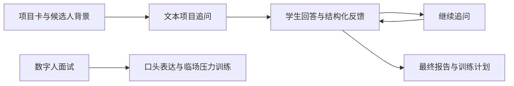

# ResearchMocker Product Memo

相较于 ChatGPT 类通用 AI 助手，ResearchMocker 是一个更接近真实科研面试的面试模拟器：学生将会面对一位 AI 面试官，讲自己的项目，然后被连续追问、被指出证据缺口，并在面试后拿到可练习的反馈报告。

## 1. 目标用户与真实痛点

该项目的目标用户是正在准备保研科研面试、科研实习面试、实验室面试或项目经历深挖面试的 CS/AI 背景本科生。通过对身边5位类似背景的学生的走访调查，我们发现学生们通常并不是完全没有项目，而是担心**自己一旦被老师连续追问，就会感受到压力**，导致讲不清楚为什么这样设计、实验是否真的证明了结论、自己到底做了哪一部分，以及失败案例和限制在哪里。真实科研面试里，这种追问有时很像 rebuttal：老师不是听完就过，而是不断挑战研究逻辑、模块必要性、对比实验和个人贡献。

虽然普通 ChatGPT 类通用 AI 助手能帮学生练问答，但它高度要求用户自己撰写 prompt，且 prompt 质量高度决定了面试效果。学生真正需要的是一个有临场压力的面试环境：它不只是温和地说“回答不错”，而是告诉你这句话为什么会被老师继续追问，缺了什么证据，下一版怎么在 1-2 分钟里讲得更好，而一般的 ChatGPT 助手很难提供这种针对性的、结构化的反馈。

通过对同类型产品的市场调研（[mock-interviews-with-ai](https://github.com/darrylschaefer/mock-interviews-with-ai), [InterviewMentor](https://github.com/PrepLabsAI/InterviewMentor), [ai-mock-interview](https://github.com/amanbind898/ai-mock-interview), [AI-Interviewer](https://github.com/johanfortus/AI-Interviewer)），我们发现，目前的 AI 面试产品虽然能够实现类似的 "提交材料 -> AI 面试官提问 -> 用户回答 -> 循环反馈 -> 生成报告" 的逻辑，但是依然存在几个核心痛点：

1. **产品性不强**：大多数项目停留在概念验证阶段，缺乏稳定的用户体验和可靠的技术实现，只能用于“个人体验”，而无法做到面向公众用户的“产品级”体验。(例如 [mock-interviews-with-ai](https://github.com/darrylschaefer/mock-interviews-with-ai), [InterviewMentor](https://github.com/PrepLabsAI/InterviewMentor))
2. **应用场景错位**：大多数项目的应用场景更接近于求职面试，而非科研面试。科研面试的追问更注重研究细节、方法论和个人贡献，而求职面试更注重行为问题和软技能，这导致现有产品无法满足我们目标用户的核心需求。
3. **缺乏临场沉浸感**：当前的 AI 面试产品大多是基于文本交互，缺乏语音和视觉的沉浸式体验，而我们目标用户更希望在一个接近真实面试环境的场景中进行练习，以更好地模拟面试压力和氛围。（例如 [ai-mock-interview](https://github.com/amanbind898/ai-mock-interview), [AI-Interviewer](https://github.com/johanfortus/AI-Interviewer)）

## 2. 产品设计与关键取舍

ResearchMocker 的核心设计目标，是把“科研项目被连续追问”这个高压力场景，转化为一个学生可以反复练习、复盘和改进的产品闭环。产品由两部分组成：一部分是围绕真实项目材料运行的文本项目追问与反馈系统，另一部分是面向临场感和展示效果的数字人面试。前者保证面试内容有训练价值，后者让学生在更接近真实面试现场的场景中练习表达。

文本主流程解决的是“练什么、怎么追问、如何复盘”的问题。为了让追问真正围绕用户痛点发生，产品流程被拆成三层：

1. **项目与候选人信息构建**：进入面试前，学生需要填写自我介绍、项目经历、目标方向和最担心的问题，并可以上传项目材料。这样系统获得的不只是“我要练面试”这个泛需求，而是一个具体学生的项目背景、贡献边界和薄弱点。后续问题会围绕这些信息展开，例如设计选择、实验依据、个人贡献和失败案例，而不是随机抛出通用问题。
2. **科研面试官提示词设计**：面试官被设计为老师/审稿人视角，而不是陪练聊天助手。提示词会约束它一次只问一个短问题，避免书面考试式长题；同时要求它优先追问空泛表述、缺少证据的指标提升、不清楚的个人贡献、薄弱的 baseline 对比和方法必要性。这使得练习更接近真实科研面试中的压力来源。
3. **结构化反馈与复盘设计**：学生每回答一轮，系统都会给出回答亮点、容易被追问的地方、老师为什么会继续追问、下次怎么答，以及 1-2 分钟口头表达是否合适。面试结束后，系统生成总评、通过风险和 24 小时训练计划，帮助学生把一次模拟面试转化为下一轮练习的具体任务。

数字人面试是 ResearchMocker 的核心亮点之一。相比普通文本页面，数字人能把“老师坐在对面追问”的压力更直观地呈现出来：学生需要开口阐述自己的项目，等待面试官回应，并在一个更接近现场面试的界面里完成练习。面试官形象、参考音频、实时语音和回复视频共同服务于“科研面试压力模拟”，让产品不只是一个文本反馈工具，也具备更强的临场感和展示辨识度。

在产品设计上，文本面试和数字人面试分别强化同一个用户痛点的两个侧面：文本面试强调项目材料、连续追问和结构化复盘，帮助学生找出回答漏洞；数字人面试强调口头表达、即时回应和面对面压力，帮助学生适应真实面试氛围。这样的结构能同时满足两个目标：一方面让产品在普通浏览器里可靠完成一次项目深挖练习，另一方面展示未来可扩展到语音、形象和面对面互动的产品形态。

当前文本面试主流程已经覆盖完整练习路径：学生输入候选人背景、目标方向、项目经历、个人贡献和薄弱点，上传 PDF、图片或文本材料后，AI 面试官会一次只问一个项目追问；学生回答后，系统给出回答亮点、风险点、分数、老师视角、节奏反馈和改写建议，并继续围绕上一轮回答追问，最后生成总评、通过风险、脆弱追问点和训练计划。数字人方向则作为产品亮点进入设计，通过实时语音、声音复刻和 OmniHuman 强化开口表达、临场压力和面对面互动体验。

核心闭环是：

关键取舍包括：

- **不做大而全题库**：科研面试的难点不是题量，而是同一个项目能否经得住连续追问。因此 ResearchMocker 把能力集中在项目深挖，而不是覆盖所有面试类型。
- **文本流程优先保证稳定闭环**：文本面试承担主要训练价值，适合展示追问、反馈、复盘和报告，也方便学生反复查看自己的回答问题。
- **数字人承担临场感和差异化展示**：数字人面试把语音、形象和实时回应组合成更接近真实面试的体验，是产品最有辨识度的扩展方向。
- **不把产品做成开发者控制台**：普通用户不需要选择 provider、配置 API Key 或理解模型路由。模型调用统一由后端管理，前端只呈现面试流程和反馈结果。
- **不在 MVP 阶段追求复杂长期记忆**：当前优先保存项目卡、材料、会话和反馈，保证一次面试能稳定跑通。长期个性化可以在产品放出后，随着用户使用量增加后再继续扩展。

## 3. 迭代记录

**V0.1 昨晚模板：全栈 AI 应用基线。** 准备阶段，我先搭了一个可运行的全栈模板：登录、SQLite、附件、LiteLLM、Next.js、Docker Compose 和 Nginx。这个版本看起来还像普通 AI 应用，但它已经具备账号、持久化、附件上传、后端模型调用和公网部署能力，为后面快速转向 ResearchMocker 留下了空间。

**V0.2 文本面试：项目追问与结构化反馈闭环。** 题目发布后，我先把方向定为 AI 面试官。很快我发现“泛面试官”太宽，做出来容易像套壳聊天。用户反馈让我把问题收窄到 CS/AI 科研项目深挖，因为这部分最容易在真实面试里暴露短板。随后我把主线体验收窄为文本项目追问与结构化反馈：通过项目卡、材料理解、连续追问、单轮反馈和最终报告，让学生能围绕自己的真实项目完成一次可复盘的模拟面试。

**V0.3 数字人面试：语音表达与面对面压力训练。** 在文本闭环稳定后，我继续加入数字人功能，用来展示 ResearchMocker 的临场感和差异化。这个版本设计了“面试官素材准备 -> 声音复刻 -> 实时语音会话 -> 面试官回应”的流程：用户上传面试官图片和参考音频，后端保存为数字人素材，并通过 Volcengine 能力生成可用于面试官发声的音色；随后建立实时语音会话，前端采集学生的麦克风输入，后端负责连接语音服务并返回面试官音频回复。前端页面也围绕这个流程做了专门设计，包括面试官画面、开始说话/停止说话控制、当前状态提示，以及后续接入 OmniHuman 视频增强所需的素材和接口结构。这样数字人不是单独的装饰页面，而是沿着“学生开口回答 -> 面试官实时回应”的真实面试体验来实现。

最后的 Demo 可靠性阶段，我重点处理附件上下文、JSON 容错、后端测试、构建和部署验证。这样文本面试可以稳定展示完整的项目追问闭环；数字人页面则用于展示产品在语音和面对面互动上的延展空间，而不是另一个孤立功能。

工程上，我复用了 FastAPI + SQLite + Next.js + Docker Compose + Nginx 的全栈基础。模型调用统一由后端通过 LiteLLM/OpenRouter 管理，前端不暴露 provider key；自动化测试 mock 外部 provider，公网部署可访问。这个选择是为了让产品不只停留在视频概念，而是能在真实 URL 上跑完一次面试。

## 4. 下一步设计与 AI 工具使用

如果再给一周，我会先继续增强文本主流程：补充不同研究方向的追问模板，优化用户项目卡结构，让提示词更稳定地区分“项目背景”和“个人贡献”，并把历史练习反馈用于下一次追问。随后再完善数字人功能：打磨实时语音、声音复刻和 OmniHuman 生成效果，优化口头问答节奏，控制首轮响应延迟，并准备一套可复现的演示素材。

AI 工具使用上，Codex 主要用于需求拆解、代码实现、测试、部署排查和文档草稿；ChatGPT/LLM 用于产品定位、文案和 prompt 思路；OpenRouter/Qwen 是当前运行时面试官、反馈与报告生成模型；Volcengine 是数字人附加功能的语音与形象能力来源。人类开发者负责最终范围决策、用户痛点判断、上线取舍、密钥管理和部署管理。

如果只看功能数量，ResearchMocker 不是一个很大的平台；但我希望它证明一件事：AI 面试产品不应该只是把聊天框换个名字，而应该把项目追问、临场压力和可执行反馈连成一个学生真的能练习的闭环。
